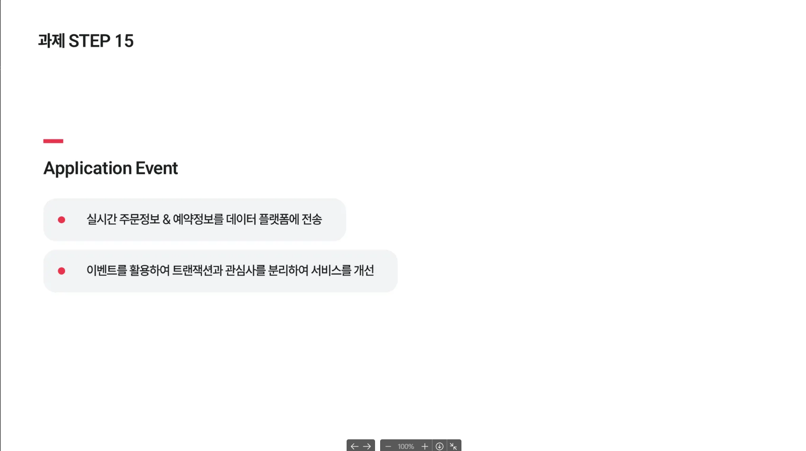
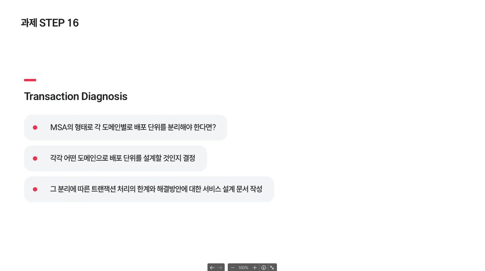

### **`필수과제 Application Event`**

- 실시간 주문정보(이커머스) & 예약정보(콘서트)를 데이터 플랫폼에 전송(mock API 호출)하는 요구사항을 이벤트를 활용하여 트랜잭션과 관심사를 분리하여 서비스를 개선합니다.

  

### **`선택과제 Transaction Diagnosis`**

- 우리 서비스의 규모가 확장되어 MSA의 형태로 각 도메인별로 배포 단위를 분리해야한다면 각각 어떤 도메인으로 배포 단위를 설계할 것인지 결정하고, 그 분리에 따른 트랜잭션 처리의 한계와 해결방안에 대한 서비스 설계 문서 작성하여 제출합니다.

  

### Try if you want

보상트랜잭션, Saga 패턴 등 활용하여 우리의 프로젝트를 고도화 해봅시다.

- Facade 활용한다면 트랜잭션을 도메인 단위로 분리하고 발생하는 분산 트랜잭션을 올바르게 구현하기
- Facade 없이 서비스간 의존하는 구조라면 어플리케이션 이벤트를 활용하여 각 서비스 의존을 없애기